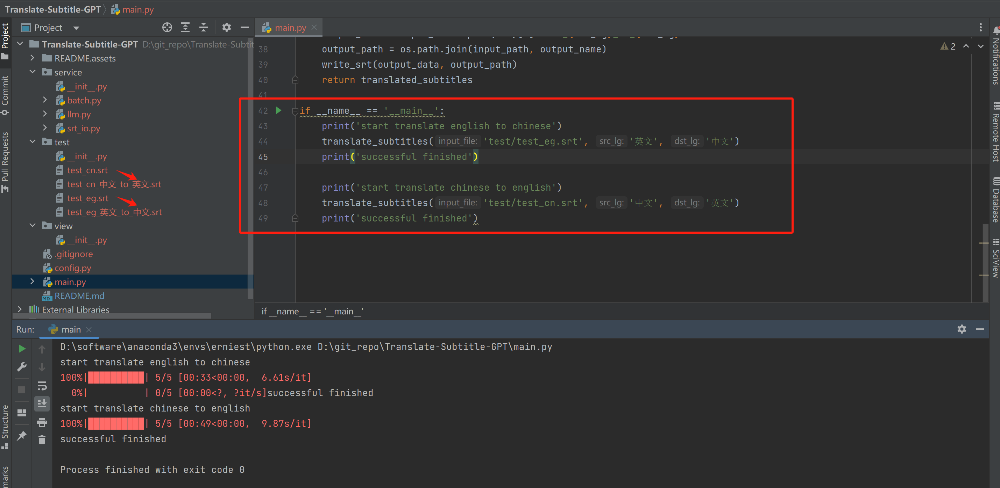

# Translate-Subtitle-GPT

**Other language versions: [English](README.md), [中文](README_zh.md).**

**Author: AFAN (WeChat: afan-life, Email: fcncassandra@gmail.com)**   

**Citation Note: This project is under the CC-BY license. Anyone can use the demonstration, but proper attribution is required.**

## Project Overview

This project uses the free `ernie-speed` interface from Baidu Qianfan's large model (Chinese GPT model) to translate subtitle files. The project is pre-configured with my own token; however, it is recommended to generate your own token if needed. For detailed instructions, refer to: https://cloud.baidu.com/article/1089328.

## Usage Instructions

After downloading the project code, run the `translate_subtitles` function in `main.py`. Input the file path, source language, and target language to start the translation. Once completed, a new file with the same name as the input file but with an added suffix will appear in the same directory as the input file.



## Project Environment

It is recommended to use `Python=3.9` for this project, and it's advisable to create a new conda environment to prevent version conflicts:

Core Python package versions:

```
qianfan==0.4.2  
tqdm
```

## Project Limitations

- The large model has TPM and RPM limits, controlled in the project by `DEFAULT_SLEEP` and `DEFAULT_BATCH_NUM` in `config.py`. To avoid API errors, it is recommended to slow down the request rate or add more robust error-handling mechanisms.

- The large model's prompt and sentence alignment capabilities between languages are limited. For example, five lines of English subtitles may not correspond directly to five lines of Chinese subtitles. Some short sentences may lose meaning, resulting in three lines being translated from five sentences. This project fills in any missing content with empty strings. You may need to adjust the `prompt` in `batch.py` to suit your needs.

- This project has only been tested with Chinese and English translations; please experiment with other languages on your own.