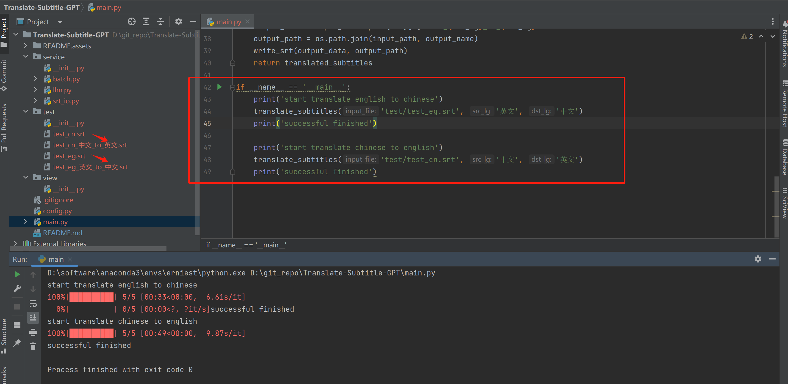

# 大模型字幕文件翻译
**其他语言版本: [English](README.md), [中文](README_zh.md).**

**作者：AFAN（微信：afan-life，邮箱：fcncassandra@gmail.com）**   

**引用说明：本项目为CC-BY协议，任何人都可以使用演示，但需要注明出处**

## 工程介绍

本工程使用百度千帆大模型(中文GPT大模型)的免费接口ernie-speed对字幕文件进行翻译，工程已经内置本人自己的token，如需使用建议自己额外生成，详细获取方式参考： https://cloud.baidu.com/article/1089328

## 使用说明

下载代码工程后，运行main.py中的translate_subtitles函数，输入文件地址、源语言和目标语言即可运行，运行完成后，输入文件的同目录下会出现和输入文件名称相同，但有后缀的文件。



## 工程环境

本工程推荐使用Python=3.9，并建议另外新建conda环境，防止版本交叉污染：

Python的核心包版本：
```
qianfan==0.4.2  
tqdm
```

## 工程不足

- 大模型存在TPM和RPM限制，工程中在config.py中用DEFAULT_SLEEP和DEFAULT_BATCH_NUM进行控制，为了防止API报错，建议降低请求速度，或增加异常捕获机制

- 大模型的prompt以及语言之间的句子对应能力有限，比如5行英文字幕可能无法对应翻译成5行中文字幕，每个短句可能难以表达意思，导致5句话可能翻译出3句话，本项目工程会对缺少的内容填补为空字符串。建议自己根据需要修正batch.py中的prompt内容

- 本工程仅尝试了中英文翻译，更多语言翻译请自行尝试